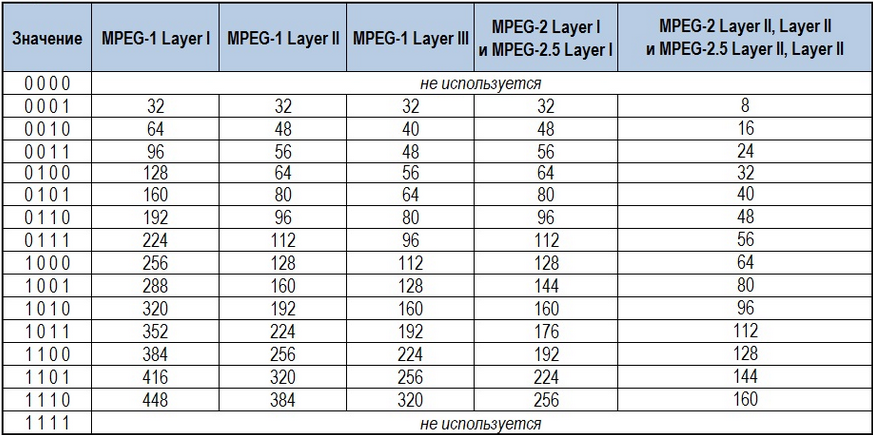
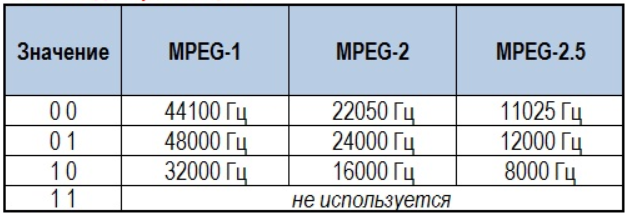
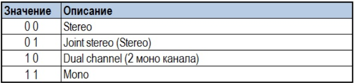

# Структура бинарника mp3-файла
**Пояснения к системе записи чисел в различных системах счисления:**  
```
Дабы различать приведённые здесь числа в различных системах счисления, введём некоторые обозначения для различных систем:  
с суффиксом h пишется число в 16-ой системе (16h), без всего пишутся числа в 10-ой системе (13), после стрелочки ->  
пишется значение этого элемента/блока/байта (в "кавычках" пишутся символы кодировки, без кавычек - числовое значение элемента,  
с приставкой 0b - двоичное (0b1001 = 9)).  
Также различные системы счисления будут написаны разными шрифтами. Названия блоков (элементов) - тоже.
```
  
**Пояснения к описанию структуры mp3-файла:**  
```
В начале пояснения к каждому блоку пишется занимаемый им объём, затем, после -> пишется значение (если известно),  
иногда для удобства оно переводится  
в другие системы счисления. Затем, после | пишется пояснение, примеры и комментарии к блоку (могут занимать и несколько строк).  
Вложенные блоки разделены табуляцией.  
```
  
**Небольшие пояснения к структуре mp3-файла:**
```
Анализ файла проводится с помощью 010 Editor.  
В каждой строке 8 байт;  
Байты нумеруются в 16-ой системе (1 строка - 0:0000, 2 - 0:0008, 3 - 0:0010 ...);  
Объём памяти под каждый объект также в 16-ой системе (1h - 1 байт, Bh - 11 байт).  
Иногда после указания объёма в 16-ой системе будет перевод в 10-ую: 10h=16Б или А2h=162Б.  
15400h = 0*16^0 + 0*16^1 + 4*16^2 + 5*16^3 + 1*16^4 = 87040.  
Каждый символ кодировки - 1 байт (8 бит), в строке 8 байт.  
1h = 1; 2h = 2; 3h = 3; 4h = 4; 5h = 5; 6h = 6Б; 7h = 7; 8h = 8; 9h = 9; Ah = 10; Bh = 11; Ch = 12; Dh = 13; Eh = 14; Fh = 15.  
0b01 = 1; 0b11011 = 27.  
```
  
## **Структура mp3-файла:**  

copyright https://github.com/Strltz/audio_steganography  
В начале и конце mp3 файлов идут теги id3 (ID3 (от англ. Identify a mp3) — формат метаданных, наиболее часто используемый в звуковых файлах в формате mp3).  
В начале идёт id3v2_tag, имеет переменную длину и размещается в начале файла, что позволяет поддерживать потоковое воспроизведение.  

**id3v2_tag**: ~15400h=87040Б или 15000h=86016Б | *здесь и хранятся сведения о названии, авторе, жанре и т.д., а также некоторая другая информацияв,* 
*нужная в т.ч. для корректного воспроизведения и отображения файла.*  
* **hdr**: ~Ah=10Б | *hdr - header - заголовок; его трогать не надо, иначе может побиться файл*  
* * **head**: ~3h -> "ID3" |  
* * **ver_major**: 1h -> 3 | *версия*  
* * **ver_revision**: 1h -> 0 | *субверсия*  
* * **flags**: 1h | *флаги*  
* * * ...  
* * **size**: 4h -> ~87030 | *длина id3v2_tag в байтах (а точнее разница длин id3v2_tag и hdr, то есть длина id3v2_tag без его заголовка)*  
* * * **raw**: 4h -> ~ 0h 5h 27h 76h | *особенность - старший бит каждого байта всегда равен 0 и не учитывается при расчёте: пример: читаем эти 4 байта как один целый*
*(то есть сливаем 4 двоичных числа в одно, как они идут по порядку), выкидывая старший бит в каждом байте:* *raw[] = `0b00000000 0b00000101 0b00100111 0b01110110` =>*
*`0b 0000000 0000101 0100111 1110110` => `0b10101001111110110` = 87030*  
* **tf\[0]**: | *просто элемент блока tf, tf - tag frame; в блоке tf хранится информация об авторе, названии, жанре и т.д*  
* * **id**: ~4h | *не самый интересный для нас блок, ещё и небольшого объёма, предназначение пока не очень понятно; заметим, что* 
*id\[0] = "TIT2"; id\[1] = "TALB"; id\[2] = "TYER"; id\[3] = "APIC"; но при изменении файл вроде не бьётся, но слетает кодировка той части информации, котрая находится* 
*в этом tf\[i] (например, вместо названия на русском языке появляются какие-то диакритические знаки или иероглифы с рунами).*  
* * **size**: | *здесь хранится размер блока frame_data (см. далее)*  
* * **flags**:  
* * * ...  
* **tf\[1]**  
* . . .
* * **frame_data**: | *в каждом tf в этом блоке хранится какая-то определённая для этого блока информация: например, в первом tf хранится название, во втором - автор* 
*в третьем - название альбома и т.д. К слову, каждый фрейм имеет вот какой формат: в первых 3 байтах 1 -1 -2 , а потом идёт информация, причём каждый символ этой информации* 
*отделён от другого нулевым байтом (`0b00000000`)*. *Например: tf\[0].frame_data[] = {1 -1 -2 "C" 0 "h" 0 "e" 0 "r" 0 "r" 0 "y" 0}*  
* **id3v2_padding**: -> `0b00000000` . . . `0b00000000` | *зарезервированное место, заполененное нулевыми байтами; при изменении файл не бьётся*  
Далее идут mp3-фреймы (mf), которые извлекаются последовательно. Во фрейме содержатся заголовок и аудиоданные.  
  
**mf\[0]**: 414h=1044Б или 415h=1045Б | *размер mp3-фрейма зависит от значения padding_bit в mped_hdr (см. далее)*  
* **mpeg_hdr**: 4h | *заголовок, здесь хранится информация об этом фрейме: маркер, индекс битрейта, бит защиты и т.д. Стоит отметить, что эта информация не распределена* 
*ровно по байтам - то есть под эту информация выделено не 4 байта, а 32 бита (и, например, frame_sync занимает 12 из них). Загололвок лучше не трогать, т.к. тогда этот* 
*фрейм будет читаться некорректно или вовсе не читаться (тогда при большом количестве битых фреймов звучание также будет битым)*
* * **frame_sync**: 12б или 11б -> `0b11 . . . 1` | *frame synchronisier или же маркер; выделено 12 (или 11 для версии mpeg2.5) бит, которые заполнены единицами; последний,* 
*12-ый бит (именно 12-ый, не 11-ый) вместе со следующим за ним битом mpeg_id отвечает за версию mpeg*  
* * **mpeg_id**: 1б | *индекс версии; как было сказано выше, он дополняет frame_sync и отвечает за версию mpeg: `0b00` - mpeg2.5; `0b01` - нет; `0b10` - mpeg2; `0b11` - mpeg1*  
* * **layer_id**: 2б | *layer - уровень; отвечает за версию layer; mp3 - mpeg1 layer 3; `0b00` - нет; `0b01` - layer 3; `0b10` - layer 2; `0b11` - layer 1;*  
* * **protection_bit**: 1б | *бит защиты; если 0 - есть 16-битная зашита CRC (алгоритм проерки целостности данных с помощью контрольной суммы),* 
*которая следует за заголовком; если 1 - то защиты нет*  
* * **bitrate_index**: 4б | *bitrate - скорость извлечения, воспроизведения (бит в секунду); для разных версий каждому индексу соответствют разные скорости:* 
  
* * **frequency_index**: 2б | *частота дискретизации, значения аналогичны индексу битрейта* 
  
* * **padding_bit**: 1б | *бит смещения, резервный бит; от него зависит размер фрейма (1044 или 1045 байт)*  
* * **private_bit**: 1б | *бит только для информации; 23-ий бит (предпоследний бит 3-го байта). То есть, чтоб узнать его значение, нужно найти разность между *
*остатками при делении числового значения 3-го байта на 4 и на 2*  
* * **channel_mode**: 2б | *режим канала (стерео, моно)* 
  
* * **mode_extension**: 2б | *мод расширения канала, используется только с joint stereo*  
* * **copyright**: 1б | *бит авторского права; 0 - не защищено; 1 - защищено*  
* * **original**: 1б |  
* * **emphasis**: 2б | *используется редко, отвечает за акцент, выразительность, нужен для того, чтоб декодер понимал, нужно ли ему проводить шумоподавление*  
* **mpeg_frame_data**: 1040Б или 1041Б | *непосредственно аудиоданные данного фрейма*  
* * **mpeg_frame_data\[0]**: 1h=1Б | *Байт*  
* * . . .  
**mf\[1]**  
. . .  
  
В конце идёт тег id3v1_tag - он имеет фиксированный тразмер - 128байт (80h)  
**id3v1_tag**: 80h=128Б | *Тоже метаданные, но в более простом формате*  
* **id**: 3h -> "TAG" | 
* **title**: 1Eh=30Б | *название*  
* **artist**: 1Eh=30Б | *автор*  
* **album**: 1Eh=30Б | *название альбома*  
* **year**: 4h=4Б | *год*  
* **comment**: 1Eh=30Б | *комментарий*  
* **genre**: 1h=1Б | *индекс жанра или 255*  
